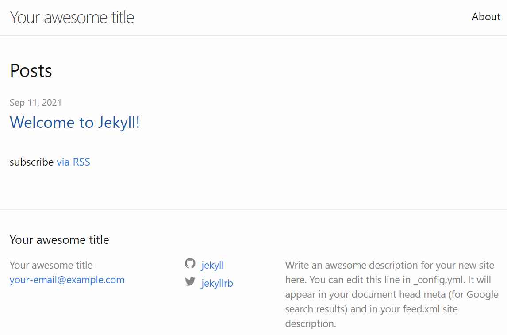

# このリポジトリについて

Visual Studio Code の Remote - Containers 拡張機能を利用して、 Jekyll をうごかすサンプルです。

## 環境構築方法

1. Docket Desktop をインストールします。

   <https://www.docker.com/products/docker-desktop>

1. WSL2 Linux カーネル更新プログラムをインストールします。

   <https://docs.microsoft.com/ja-jp/windows/wsl/install-win10#step-4---download-the-linux-kernel-update-package>

1. Visual Studio Code をインストールします。

   <https://azure.microsoft.com/ja-jp/products/visual-studio-code/>

1. Visual Studio Code の Remote - Containers 拡張機能をインストールします。

   <https://marketplace.visualstudio.com/items?itemName=ms-vscode-remote.remote-containers>

## 基本的な使い方

1. Docker Desktop を起動します（Windowsの起動時に同時起動する設定もあります）。

1. このリポジトリ一式を取得（フォークするなりリリースページから Zip ファイルでダウンロードするなりお好きにどうぞ）します。

   <https://github.com/tsuna-can-se/VSCodeRemoteContainersForJekyll/releases>

1. Visual Studio Code でルートディレクトリを開きます。

1. Visual Studio Code 左下のアイコンを押下します。

   

1. [Reopen in Container] を選択します。

   

1. コンテナーが起動するまでしばらく待機します。
   左下のアイコンが以下のようになると、コンテナーの実行ができている状態です。

   

1. その間ブラウザーが自動的に立ち上がります。
   コンテナー起動後、静的サイトのビルドや関連パッケージのダウンロードが行われます。
   初回起動時は起動するまでそれなりにかかるので、気長に待ちましょう。

1. [docs] ディレクトリ内に [_site] ディレクトリが生成されたら、静的サイトの生成は完了しています。
   起動したブラウザー画面をリロードすると、以下のような画面が表示されます。

   

1. [docs] ディレクトリ内に Jekyll のファイル群を作成していってください。
   編集したファイルを保存すると、ブラウザー画面もリロードされます。

## 再起動

設定ファイルや Gemfile の修正を行った場合は、コンテナーの再起動を行ってください。
画面左下の [Dev Container] ボタンを押下して、[Rebuild container] を選択します。

